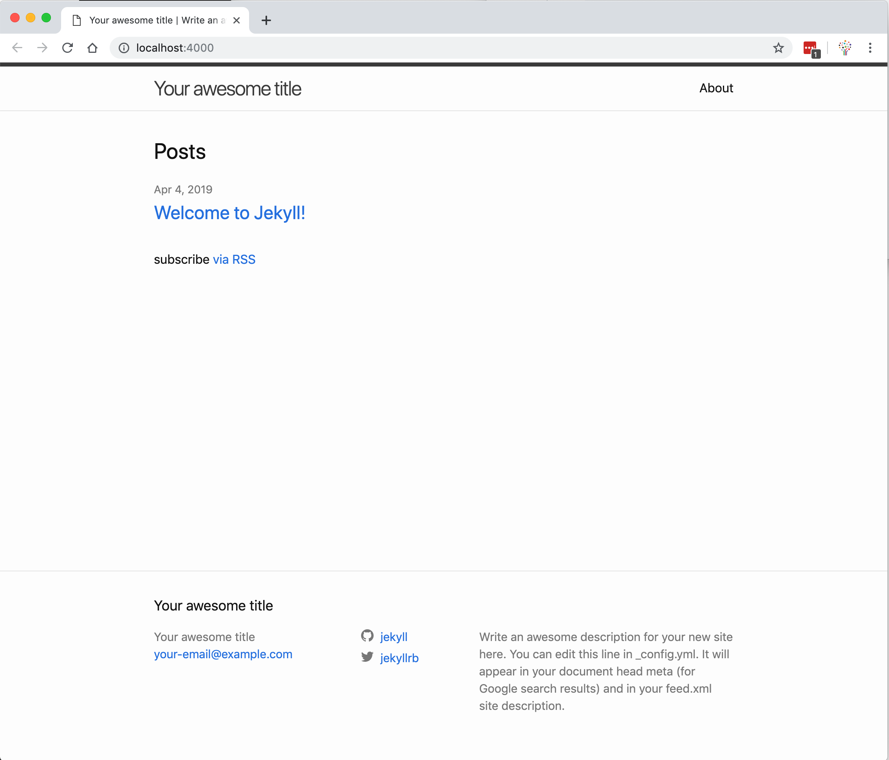
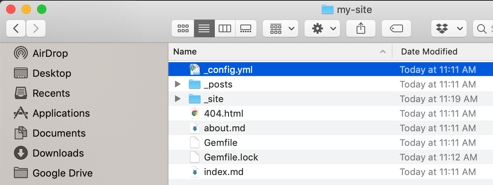

# Getting Started

Now we are ready to get our first site set up and running. In order to do so, we need to create a new site. You can create a site inside an already existing folder but in the following, we'll set up a clean site using Jekyll's own generator.

## Decide Location

First, you need to decide where your site should live locally. In order to navigate to the Desktop folder of your user account, run this command in your command line:

```console
cd ~/Desktop
```

_In our example, we'll put the site on your computer's desktop but you may want to navigate to a different directory. You can do this by using `cd` as you may remember from our [command line workshop](http://www.github.com/DHRI-Curriculum/command-line)._

We will create a new Jekyll site on the desktop by writing:

```console
jekyll new my-site
```

This command may take some time to run, so take a break—stand up and stretch your arms—while it runs. Once it is done, your command line should have an output that looks something like this:

```console
Running bundle install in ~/Desktop/my-site... 
  Bundler: Fetching gem metadata from https://rubygems.org/...........
  Bundler: Fetching gem metadata from https://rubygems.org/.
  Bundler: Resolving dependencies...
  Bundler: Fetching public_suffix 3.0.3
  Bundler: Installing public_suffix 3.0.3
  Bundler: Fetching addressable 2.6.0
  Bundler: Installing addressable 2.6.0
  Bundler: Using bundler 2.0.1
  Bundler: Using colorator 1.1.0
  Bundler: Fetching concurrent-ruby 1.1.5
  Bundler: Installing concurrent-ruby 1.1.5
  Bundler: Fetching eventmachine 1.2.7
  Bundler: Installing eventmachine 1.2.7 with native extensions
  Bundler: Using http_parser.rb 0.6.0
  Bundler: Using em-websocket 0.5.1
  Bundler: Fetching ffi 1.10.0
  Bundler: Installing ffi 1.10.0 with native extensions
  Bundler: Using forwardable-extended 2.6.0
  Bundler: Using i18n 0.9.5
  Bundler: Using rb-fsevent 0.10.3
  Bundler: Fetching rb-inotify 0.10.0
  Bundler: Installing rb-inotify 0.10.0
  Bundler: Using sass-listen 4.0.0
  Bundler: Fetching sass 3.7.4
  Bundler: Installing sass 3.7.4
  Bundler: Using jekyll-sass-converter 1.5.2
  Bundler: Using ruby_dep 1.5.0
  Bundler: Using listen 3.1.5
  Bundler: Fetching jekyll-watch 2.2.1
  Bundler: Installing jekyll-watch 2.2.1
  Bundler: Fetching kramdown 1.17.0
  Bundler: Installing kramdown 1.17.0
  Bundler: Fetching liquid 4.0.3
  Bundler: Installing liquid 4.0.3
  Bundler: Using mercenary 0.3.6
  Bundler: Fetching pathutil 0.16.2
  Bundler: Installing pathutil 0.16.2
  Bundler: Fetching rouge 3.3.0
  Bundler: Installing rouge 3.3.0
  Bundler: Fetching safe_yaml 1.0.5
  Bundler: Installing safe_yaml 1.0.5
  Bundler: Using jekyll 3.8.5
  Bundler: Fetching jekyll-feed 0.12.1
  Bundler: Installing jekyll-feed 0.12.1
  Bundler: Fetching jekyll-seo-tag 2.6.0
  Bundler: Installing jekyll-seo-tag 2.6.0
  Bundler: Fetching minima 2.5.0
  Bundler: Installing minima 2.5.0
  Bundler: Bundle complete! 4 Gemfile dependencies, 29 gems now installed.
  Bundler: Use `bundle info [gemname]` to see where a bundled gem is installed.
  Bundler: Post-install message from sass:
  Bundler: 
  Bundler: Ruby Sass has reached end-of-life and should no longer be used.
  Bundler: 
  Bundler: * If you use Sass as a command-line tool, we recommend using Dart Sass, the new
  Bundler: primary implementation: https://sass-lang.com/install
  Bundler: 
  Bundler: * If you use Sass as a plug-in for a Ruby web framework, we recommend using the
  Bundler: sassc gem: https://github.com/sass/sassc-ruby#readme
  Bundler: 
  Bundler: * For more details, please refer to the Sass blog:
  Bundler: https://sass-lang.com/blog/posts/7828841The dependency tzinfo-data (>= 0) will be unused by any of the platforms Bundler is installing for. Bundler is installing for ruby but the dependency is only for x86-mingw32, x86-mswin32, x64-mingw32, java. To add those platforms to the bundle, run `bundle lock --add-platform x86-mingw32 x86-mswin32 x64-mingw32 java`.
New jekyll site installed in ~/Desktop/my-site. 
```


## Serve the Server

We are now ready to navigate into our new site directory using the change directory command `cd`:

```console
cd my-site
```

Once inside the directory, we will build the site and make it available to us. Jekyll provides a command which you will use _a lot_ if you work with the generator (write it down on a notepad next to you!):

```console
bundle exec jekyll serve
```

Once you run this command, Jekyll will start up a local server, which you can navigate to in your web browser by going to http://localhost:4000/.


## Your First Site

The first site that Jekyll has generated looks something like this:



A lot of "awesome" and too little content.


## The Backend of Your First Site

If you use the GUI interface on your computer (Finder on a Mac and Explorer on a PC) and navigate to the directory where we set up the site, you will see that it contains a number of files:



This is what is called the "backend" of your site. For now, we will not care too much about the files but we will look more in-depth at some of them in the next couple of pages in this workshop.

For now, you can just peek into the folder called `_site` and see that Jekyll has automatically generated content in this folder, which can be uploaded to any server anywhere and that will look exactly the same everywhere. Jekyll uses these files for the local server that is located at http://localhost:4000/.


## Exiting

In the next couple of pages, we will work more in-depth with a site to understand Jekyll's structure and formatting but this is the simple way to set up a site based on blog posts.

For now, let's go back to the command line where you should still see the server running:

```console
Configuration file: ~/Desktop/my-site/_config.yml
            Source: ~/Desktop/my-site
       Destination: ~/Desktop/my-site/_site
 Incremental build: disabled. Enable with --incremental
      Generating... 
       Jekyll Feed: Generating feed for posts
                    done in 0.891 seconds.
 Auto-regeneration: enabled for '~/Desktop/my-site'
    Server address: http://127.0.0.1:4000/
  Server running... press ctrl-c to stop.
```

Hold down the `ctrl` key on your keyboard and press `c` simultaneously. The server should shut down and you should be back at a `$` prompt.
